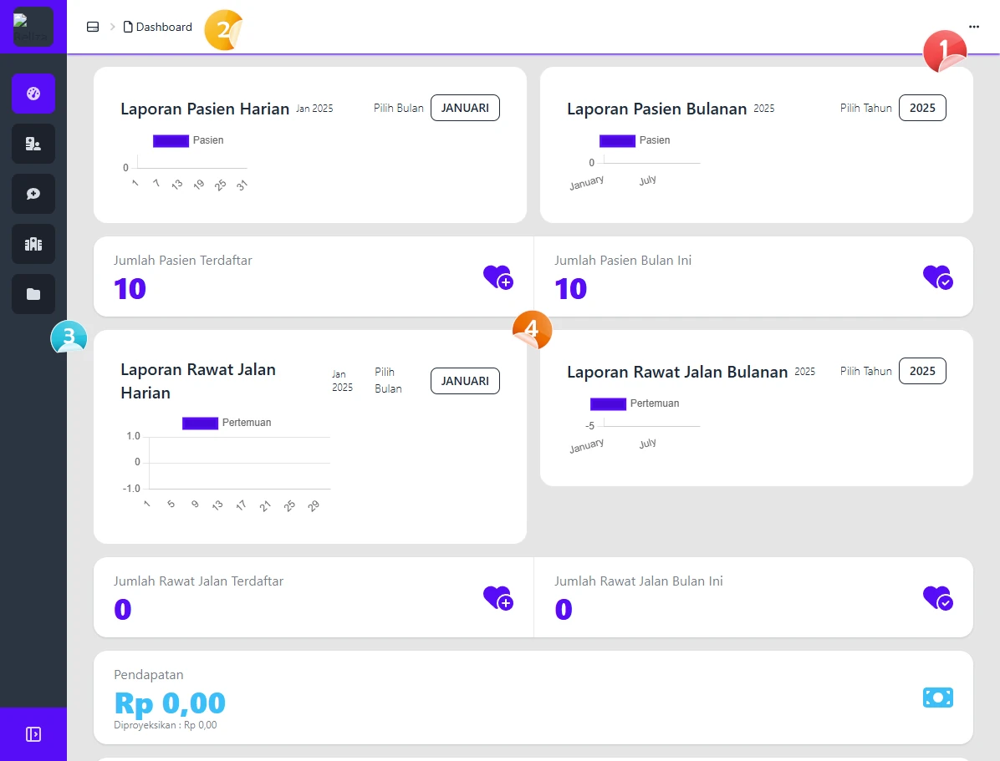
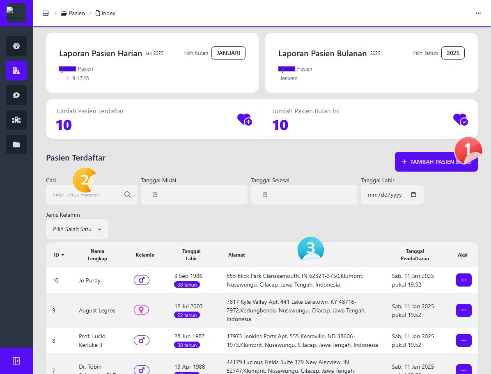
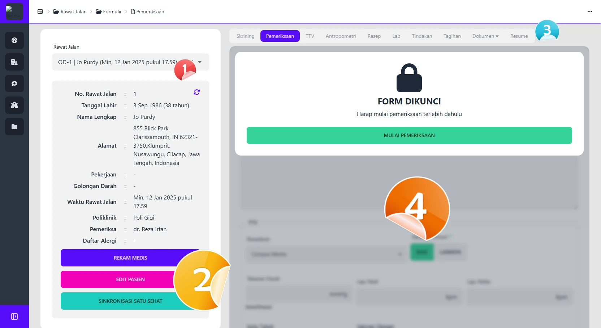

# Antarmuka Pengguna

## Pendahuluan
Dokumentasi ini menjelaskan elemen-elemen utama antarmuka pengguna (User Interface/UI) dari aplikasi rekam medis elektronik. Setiap elemen akan dijelaskan dengan gambar tangkapan layar yang diberi label untuk memudahkan pemahaman.

---

## Gambar Antarmuka Pengguna
**Gambar 1: Tampilan Utama Aplikasi**

### Elemen yang Ditampilkan

1. **Menu Pengaturan**
   - Berisi beberapa opsi utama untuk mengelola preferensi dan pengaturan aplikasi.
     - **Bridging Satu Sehat**: Untuk integrasi data dengan platform Satu Sehat.
     - **Tema Antarmuka Pengguna**: Mengubah tema aplikasi (gelap/terang).
     - **Profil**: Menampilkan informasi pengguna saat ini.
     - **Pengaturan**: Pengaturan lanjutan aplikasi.
     - **Logout**: Keluar dari aplikasi.

2. **Breadcrumb**
   - Fungsi: Breadcrumb menampilkan lokasi pengguna dalam hierarki navigasi aplikasi. Dengan fitur ini, pengguna dapat dengan mudah mengetahui posisi mereka dan kembali ke halaman sebelumnya tanpa harus menggunakan tombol navigasi tambahan.

3. **Sidebar**
   - Sidebar digunakan untuk navigasi antar modul aplikasi. Menu di sidebar dapat mencakup:

4. **Content Area**
   - Berisi informasi utama yang ditampilkan sesuai menu yang dipilih. Contoh informasi yang bisa ditampilkan:

## Gambar Antarmuka Pengguna Modul

**Gambar 2: Tampilan Modul** 

### Elemen yang Ditampilkan

1. **Tambah Modul**
   - Pada gambar ini, contoh modul adalah **Tambah Pasien**.
   - Fungsi: Digunakan untuk menambah data baru ke modul tertentu. Pengguna dapat mengisi informasi yang diperlukan sesuai dengan form yang tersedia.

2. **Filter Form**
   - Fungsi: Menyediakan form untuk memfilter data yang ingin ditampilkan. Misalnya, pengguna dapat mencari pasien berdasarkan nama, nomor rekam medis, atau tanggal kunjungan.

3. **List**
   - Fungsi: Menampilkan daftar data yang sesuai dengan filter yang telah diterapkan.
   - Pada beberapa modul, terdapat tombol aksi di setiap baris data, seperti **Edit**, **Hapus**, atau **Detail**.

---

## Gambar Antarmuka Pengguna Rawat Jalan
**Gambar 3: Tampilan Rawat Jalan**

### Elemen yang Ditampilkan

1. **Selector Rawat Jalan**
   - Fungsi: Memungkinkan pengguna untuk mengganti data pertemuan rawat jalan. Dengan ini, pengguna dapat memilih kunjungan yang sesuai untuk melihat atau mengedit data pemeriksaan.

2. **Tombol-Tombol Pembantu**
   - Fungsi: Berisi beberapa tombol yang mempermudah akses ke fungsi-fungsi penting, seperti:
     - Melihat rekam medis.
     - Mengedit informasi pasien.
     - Mengirim data ke **Satu Sehat** untuk integrasi.

3. **Tabs**
   - Fungsi: Berisi kategori data yang dapat diisi selama pemeriksaan.

4. **Content**
   - Fungsi: Menyediakan form untuk menginput data pemeriksaan sesuai dengan kategori yang dipilih pada tab. Form ini dapat mencakup teks, dropdown, atau checkbox untuk melengkapi informasi pasien.

---

