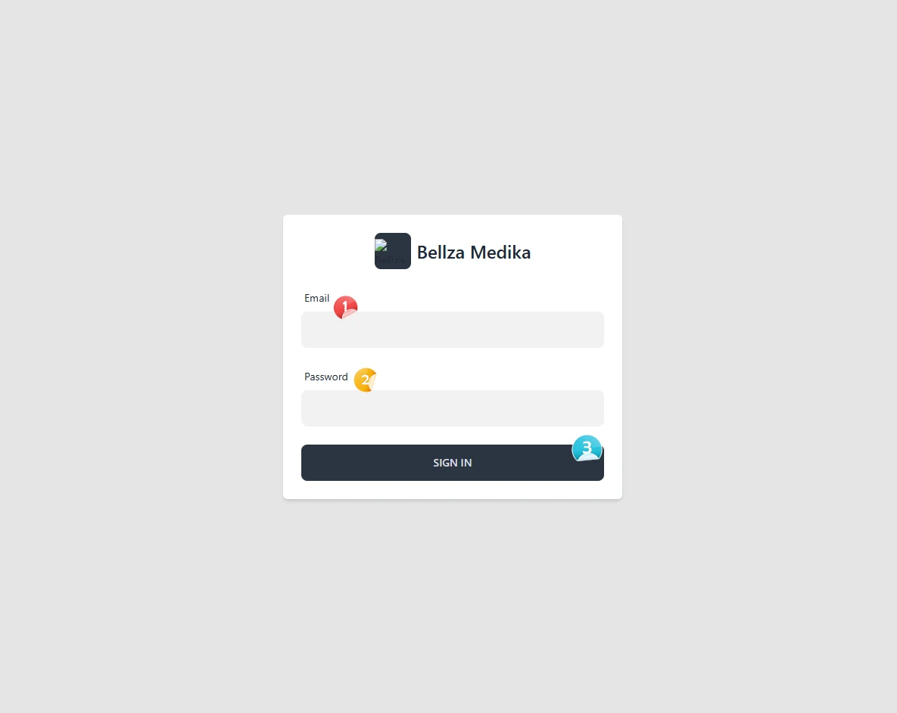
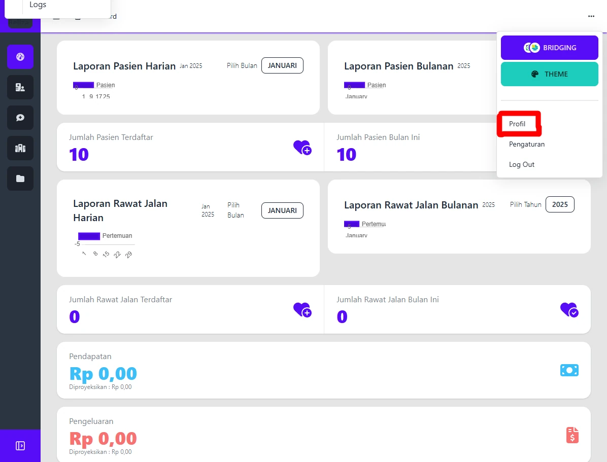

# Login 

# Panduan Login Aplikasi

Panduan ini menjelaskan cara melakukan login ke aplikasi Bellza EMR untuk pertama kali.

## 1. Alamat Login
Untuk mengakses halaman login, buka URI berikut:
```
/user/login
```
Contoh jika aplikasi berjalan secara lokal:
```
http://127.0.0.1:8000/user/login
```



## 2. Data Login Awal
Gunakan data login berikut untuk pertama kali:
- **Email**: `admin@email.com`
- **Password**: `password`

## 3. Mengubah Email dan Password
Demi keamanan, sangat disarankan untuk segera mengganti email dan password default setelah berhasil login. Langkah-langkah:


1. Buka menu profil atau pengaturan pengguna di dalam aplikasi.



2. Masukkan data baru yang aman:
   - **Email**: Gunakan alamat email aktif yang Anda kendalikan.
   - **Password**: Gunakan kombinasi huruf besar, huruf kecil, angka, dan simbol dengan panjang minimal 8 karakter.
3. Simpan perubahan.

Dengan mengganti email dan password, Anda dapat meningkatkan keamanan akun dan melindungi data aplikasi Anda.

